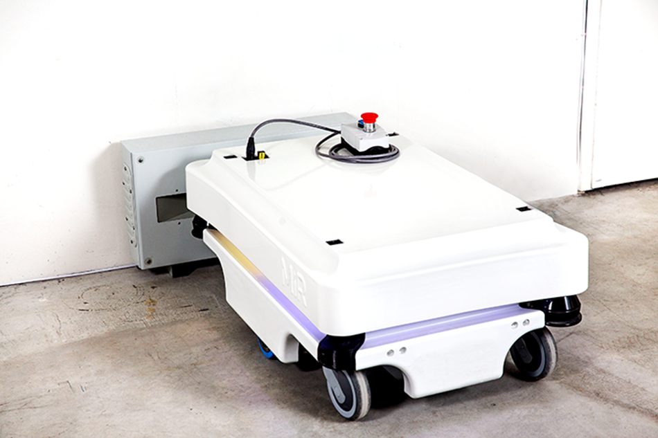

# Astor-MiR

Project created during apprenticeship in ASTOR Poznan 2022.

# Project tasks

:heavy_check_mark: - MySQL read/write data from robot, PHPMyAdmin web tool

:heavy_check_mark: - Window app with live camera view, current informations about robot state, buttons responsible for calling robot to particular place and battery percentage graph refreshed every 30 seconds

:x: - Check connection with MySQL database, ESP32CAM and MiR100 robot

# Project includes

- MiR 100 - cooperative mobile robot with a load capacity of up to 100 kg:
	
	

- Web aplication made using PySimpleGUI:

	

	

- MySQL database with Apache server and PHPMyAdmin tool:

	

- ESP32CAM - microcontroller module with WiFi connection and camera:

	

# Demonstration video

	[demo_video](https://youtu.be/8ByWWWsOIjM)

# How to use (tutorial in Polish)

Poradnik uruchomienia aplikacji w języku polskim na systemie Windows znajduje się w pliku "Poradnik - Aplikacja MiR.pdf".